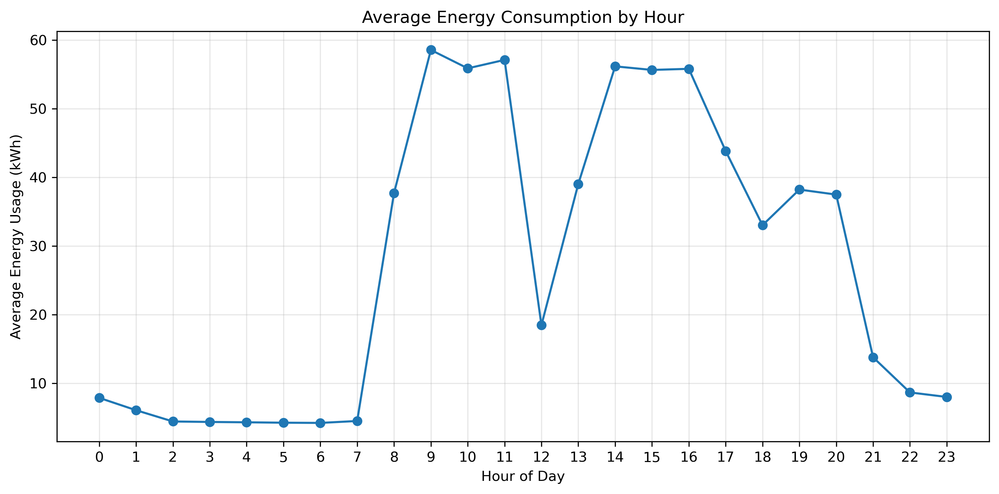
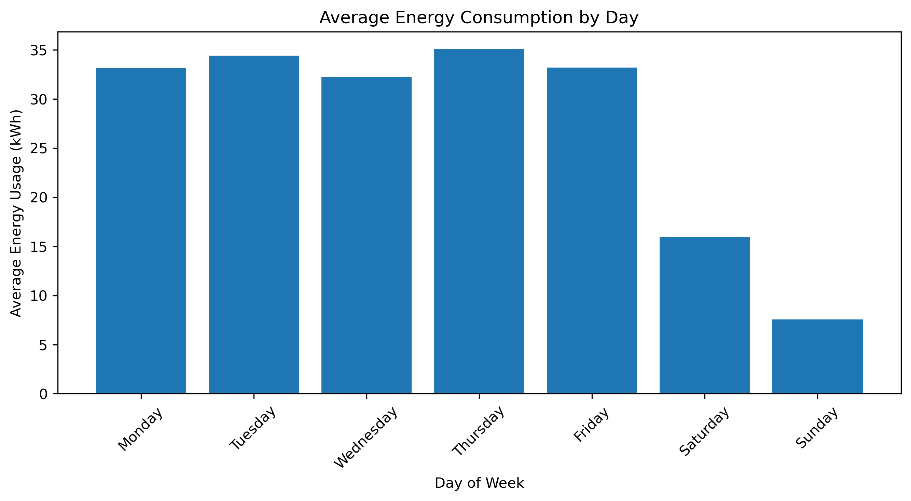
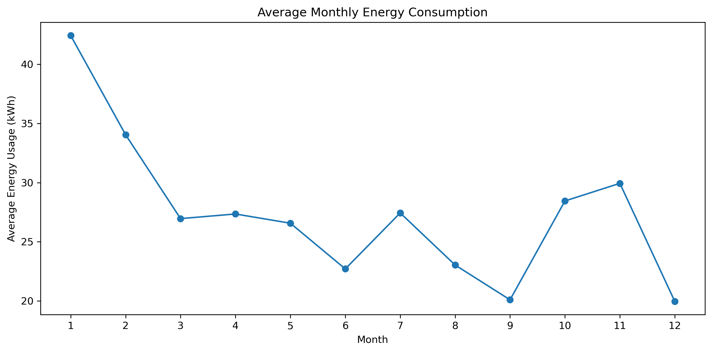
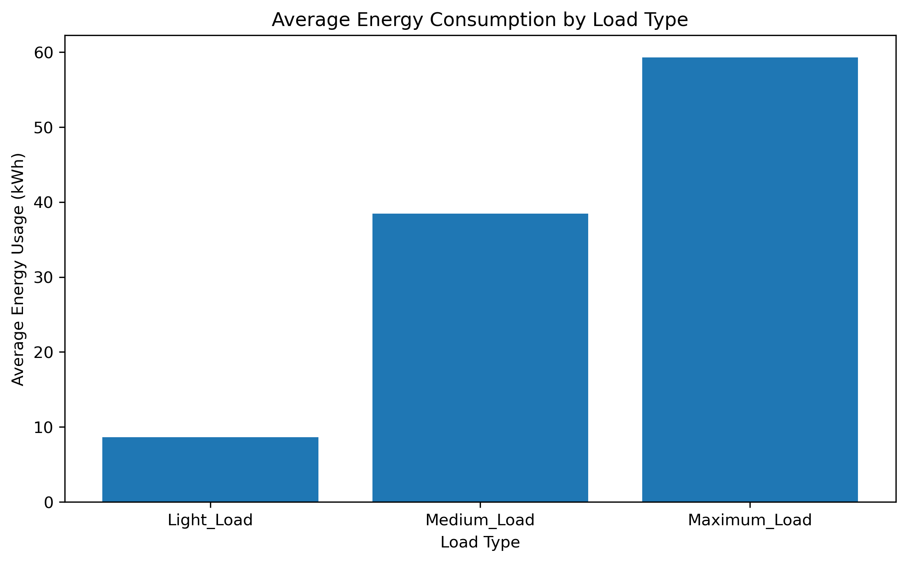

# Steel Industry Energy Consumption Analysis

## Overview

This project analyzes electricity consumption patterns from a steel industry dataset using SQL and DuckDB.

The goal was to build a small ETL and analytical workflow to transform raw energy data into a structured dataset and identify patterns related to operating load, time of day, weekdays, monthly consumption, and recorded CO₂ emissions.

The project also provided an opportunity to apply data analytics to an industrial dataset related to my mechanical engineering background.

## Objectives

The analysis focuses on:

- Identifying hourly energy consumption patterns
- Comparing weekday and weekend energy usage
- Analyzing consumption across different operating load levels
- Identifying daily and monthly consumption patterns
- Examining energy consumption alongside recorded CO₂ emissions
- Analyzing power factor behavior
- Identifying monthly peak consumption hours

## Tools

- **SQL** — Data transformation and analysis
- **DuckDB** — Local analytical database and ETL
- **Python** — Analysis workflow
- **Pandas** — Data handling
- **Matplotlib** — Data visualization
- **Jupyter Notebook** — Analysis environment

## Project Workflow

The project follows a simple ETL and analytical workflow:

**Raw CSV → Raw DuckDB Table → Data Validation → Transformation → Analytical Table → SQL Analysis → Visualization**

### Extract

The original CSV dataset was loaded into DuckDB while preserving its original structure in a raw table.

### Transform

The transformation process included:

- Converting the date field from text to timestamp format
- Standardizing column names
- Creating an hour variable for time-based analysis
- Validating missing values and duplicate timestamps
- Checking categorical values and numerical ranges

The transformation preserved all **35,040 observations**.

### Analyze

SQL was used to investigate energy consumption across different operating and temporal conditions.

The analysis included aggregations, `GROUP BY`, `CASE` expressions, date/time functions, Common Table Expressions (CTEs), and a window function.

## Key Findings

- Electricity consumption follows a clear daily operating pattern, with substantially higher usage during working hours.
- Average consumption during the defined working-hours period was **48.26 kWh**, compared with **26.14 kWh** during the evening and **5.00 kWh** overnight.
- The highest overall hourly average occurred at **09:00**, with approximately **58.55 kWh**.
- Average weekday consumption was **33.62 kWh**, compared with **11.73 kWh** during weekends.
- Thursday had the highest average daily consumption at **35.11 kWh**, while Sunday had the lowest at **7.55 kWh**.
- January recorded the highest monthly average consumption at **42.42 kWh**.
- Average consumption increased from **8.63 kWh** during Light Load to **38.45 kWh** during Medium Load and **59.27 kWh** during Maximum Load.
- Higher operating load categories were also associated with higher recorded CO₂ values.
- Peak consumption time varied throughout the year, although **09:00 was the most frequent monthly peak hour**, occurring in seven of the twelve months.

## Visualizations

### Hourly Energy Consumption

### Energy Consumption by Day

### Monthly Energy Consumption

### Energy Consumption by Load Type

## SQL Techniques Used

- Aggregations
- `GROUP BY`
- `ORDER BY`
- Date and time transformations
- `CASE` expressions
- Common Table Expressions (CTEs)
- Window functions
- Data validation queries

## Conclusion

The analysis identified clear temporal and operational patterns in the facility's electricity consumption. Energy demand was concentrated primarily during weekday working hours, while nights and weekends showed substantially lower average consumption.

Higher operating load categories were associated with higher electricity consumption and recorded CO₂ values. Monthly peak-demand analysis also showed that peak timing varied throughout the year, with 09:00 appearing most frequently as the monthly peak hour.

These findings could support further investigation into production scheduling, peak-demand management, energy efficiency, and emissions monitoring.
